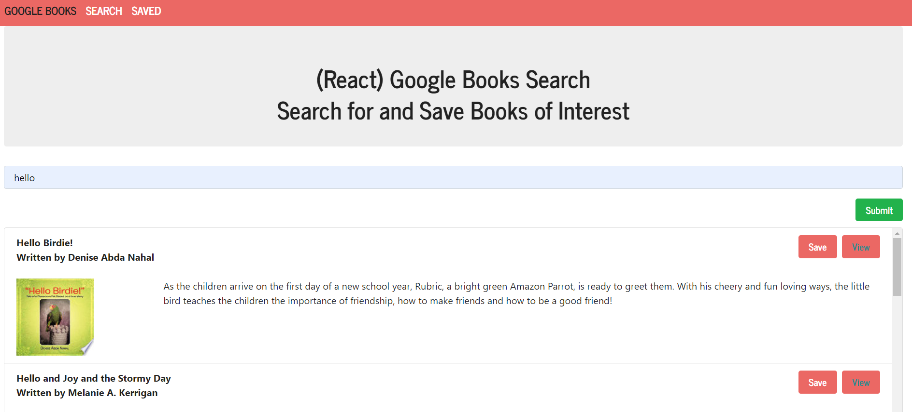
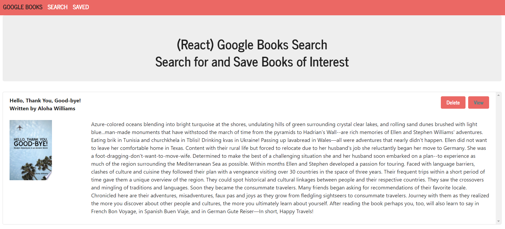

# Selma's HW21 React Google Books

## Description:

In this activity, I am building an application which serves as a search library for Google Books. In utilizing the Google Books API documentation, I implemented a way to search for books by title. Once searched, the page will render all book selections that begin with the value of the input. Additional information is output, including the author, description, image thumbnail, and link to the exact Google Book webpage to purchase. The application also allows you to save your favorite books for reference or delete them when you want them removed. The entire application was built using React, Express, Axios, React Hooks, and React Bootstrap.

## Installation:

- If you need to pull my code for this homework, please visit my Github repository at: https://github.com/selma-e/google-books-search
- If you want to see the final deployed webpage, please visit my hosted website at: https://blooming-garden-95148.herokuapp.com/

## Usage:

## Resources Used/Credits:

- https://react-bootstrap.github.io/
- https://reactjs.org/docs/hooks-effect.html
- https://developer.mozilla.org/en-US/docs/Web/JavaScript/Reference/Global_Objects/Array/map

© 2021 Selma Elgabalawy | UW-SEA-FSF-PT-08-2020-U-C-TTh
